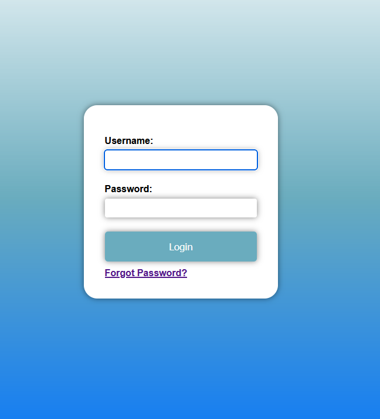
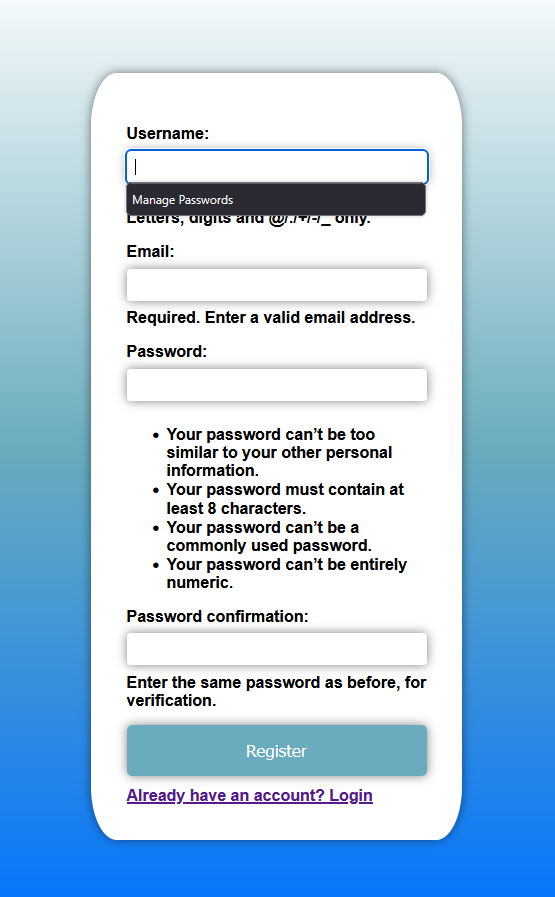

# Employee System

A simple Django-based Employee System with user authentication (login, registration, password reset).

## Dependencies

- Django
- python-dotenv
- django-celery-beat
- celery
- redis (for Celery broker)

Install dependencies with:

```
pip install django python-dotenv django-celery-beat celery redis
```

---

## Setup Instructions

1. **Clone the repository**

   ```
   git clone <repo-url>
   cd mini_project-1/employee_system
   ```

2. **Create and activate a virtual environment**

   ```
   python -m venv env
   env\Scripts\activate  # On Windows
   # or
   source env/bin/activate  # On Mac/Linux
   ```

3. **Install dependencies**

   ```
   
   pip install django python-dotenv django-celery-beat celery redis
   ```

4. **Apply migrations**

   ```
   python manage.py migrate
   ```

5. **Create a superuser**

   ```
   python manage.py createsuperuser

6. **Run Redis (required for Celery)**

   - If you have Docker installed, you can use the provided docker-compose file:
     ```
     docker-compose up -d
     ```
   - Or install Redis locally and run it on port 6379.

7. **Run Celery and Celery Beat (for scheduled tasks)**

   In separate terminals:
   ```
   celery -A employee_system worker --pool=solo -l info
   celery -A employee_system beat -l info
   ```

8. **Run the development server**

   ```
   python manage.py runserver
   
7. Open your browser and visit http://127.0.0.1:8000/

- **Celery not working?** Ensure Redis is running and celery/beat are started in separate terminals.
- **Emails not sent?** Check your email credentials and allow less secure apps or use an app password for Gmail.
- **Static files not loading?** Ensure `STATICFILES_DIRS` and `STATIC_URL` are set correctly in `settings.py`.

---

## Screenshots

Home Page


Login Page


Password Reset Page


Register Page
 


## sample user and password

username: testuser (my super user)
password: 7722

username: poshnova1
password: luxshtech@2025

username: pratik77
password: luxsh@2025